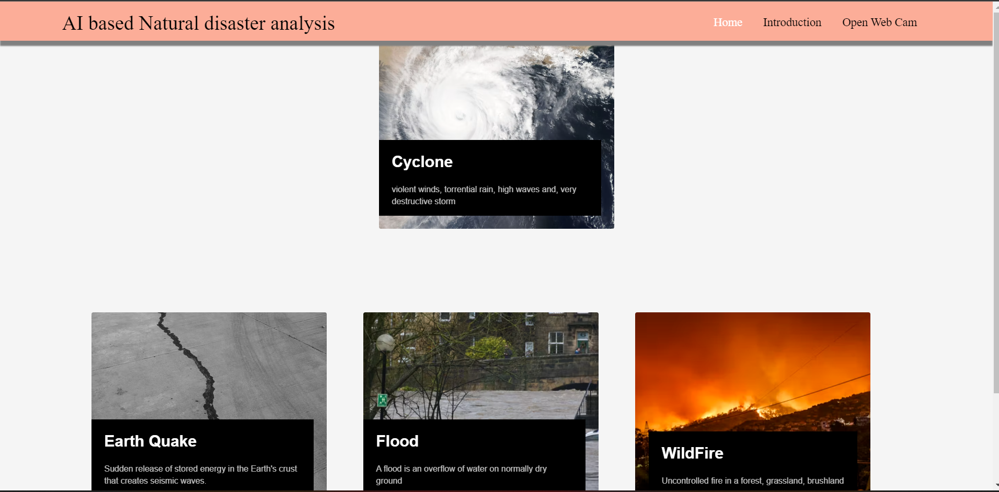
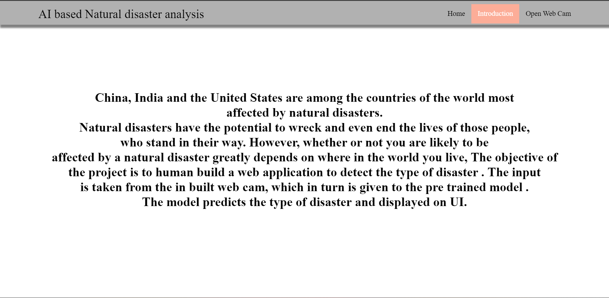
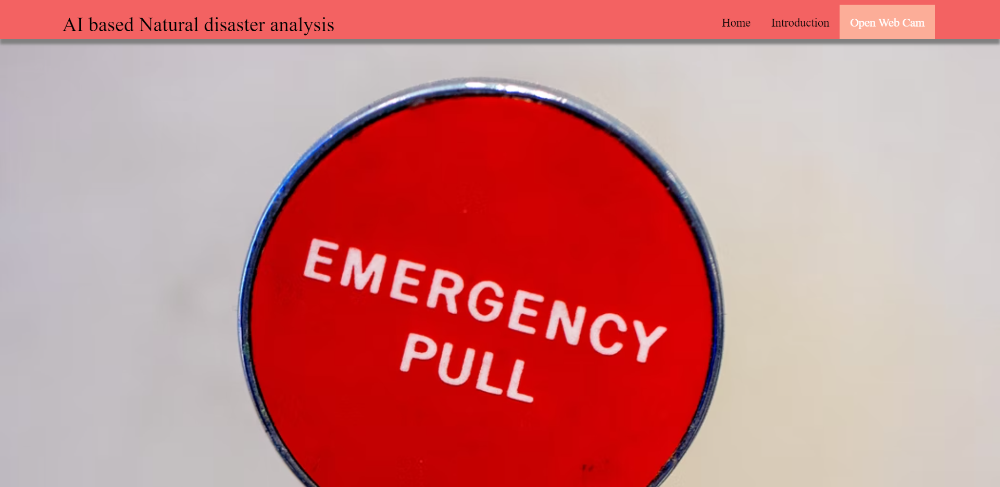
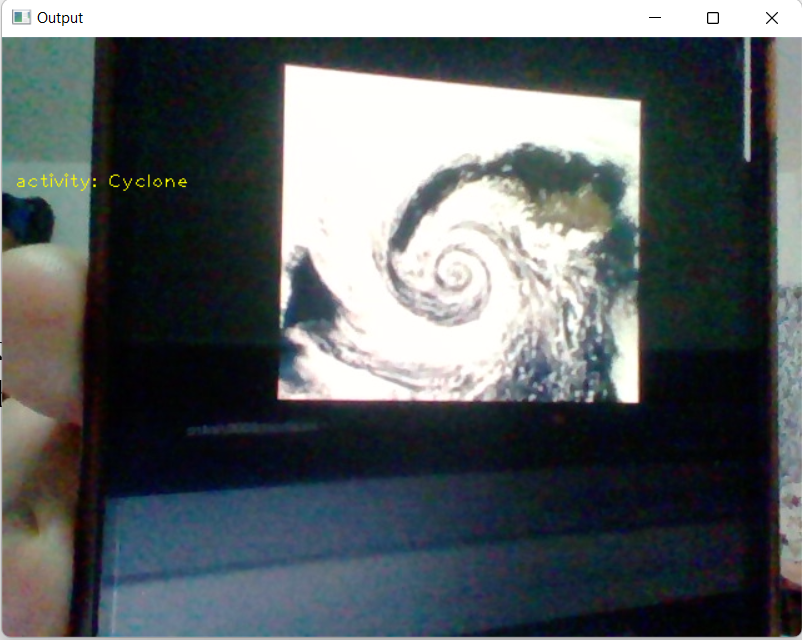
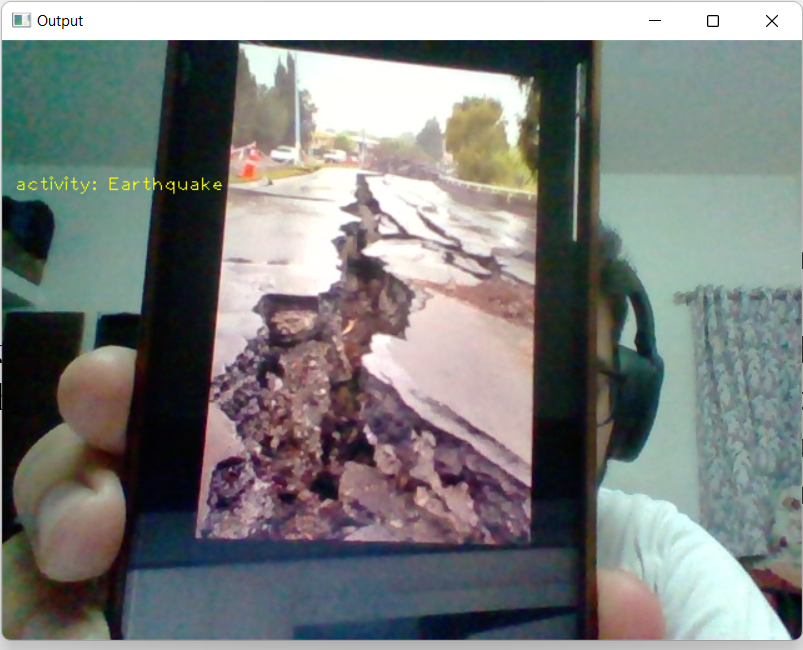
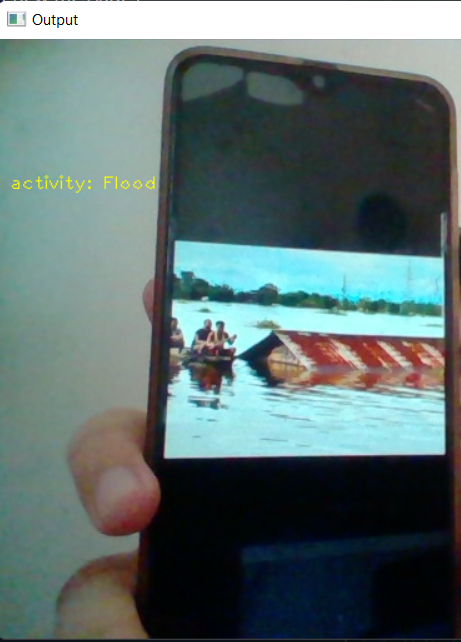

# Natural Disasters Intensity Analysis and Classification using Artificial Intelligence

Model trained in ibm cloud using Tensorflow and web-app made using flask.

## Project screenshots

### Homepage

### Introduction page

### Upload page

### Video cam prediction results

### Cyclone

### Wildfire

### Earthquake

### Flood

## Demo

Demo video

